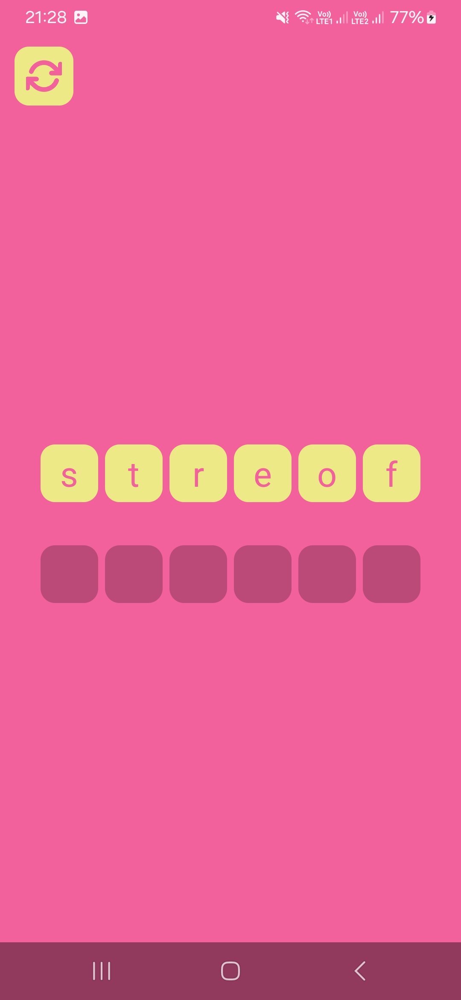

# GuessWord 
A Kotlin project made using MVVM architecture, Coroutines & StateFlow, Android DragEvent API, and SDP/SSP for adaptive dimensions

## Language: Kotlin
## Architecture: MVVM (Model-View-ViewModel)
## Tech: 
* Kotlin Coroutines, StateFlow
* XML layouts, custom drawables, styles
* Adaptive dimensions: SDP & SSP
* Drag & drop: Android DragEvent API

### Screenshots:
</img>
</img>
</img>
</img>
